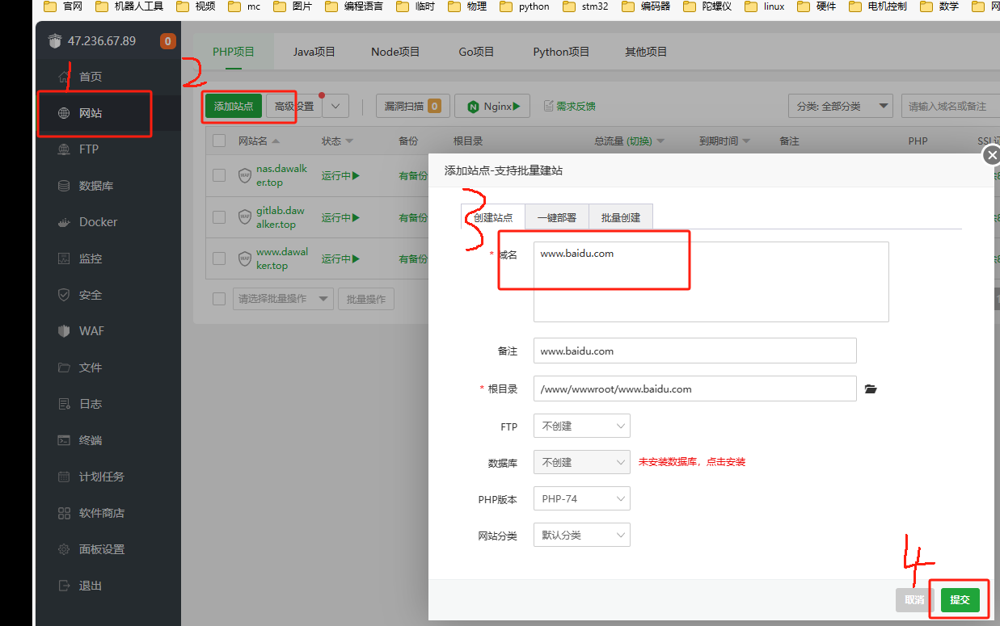
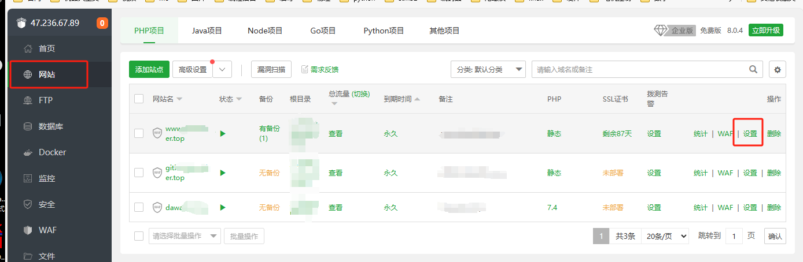
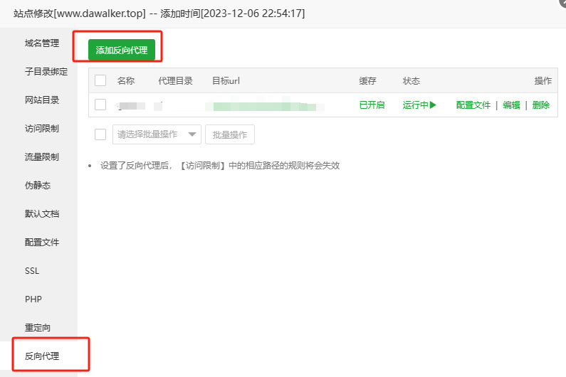
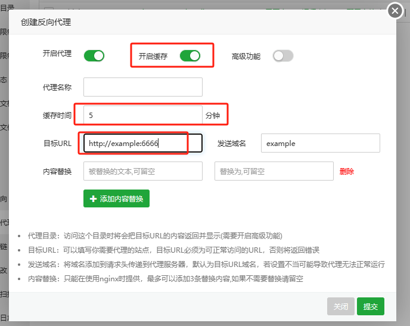

一个服务器上不可能仅仅只提供一个服务，每个服务都有自己的服务端口。我们往往访问网站时一般通过域名访问，众所周知，域名在DNS服务中只能被解析为ip。那么，我们是怎么通过特定域名准确访问到需要的服务的呢？这里依靠的就是反向代理。反向代理服务可以通过识别访问的域名来将流量重新转发到对应的端口上，使访问者得到准确的服务响应。


## 基于宝塔面板的反向代理
反向代理用于用户在访问域名时，系统根据访问的域名自动跳转到其他的端口或域名，可以用于隐藏端口号或保护真实服务器。

打开站点管理页面，新建站点：

进入站点设置


然后添加反向代理


开启缓存可以用户反复访问时有效提高响应速度，但是权限等变化后会有延时实现，看情况开，时间尽量短，在追求高安全性的地方最好别开。目标URL写上自己的域名加端口号即可，注意后端的接口是使用http还是https



查询反向代理是否实现，在反向代理服务器上运行：
```
curl http://www.dawalker.top
```


## 传输文件大小的设置
参照[反向代理的配置](../../pve/群晖/alist的安装.md)最后一段