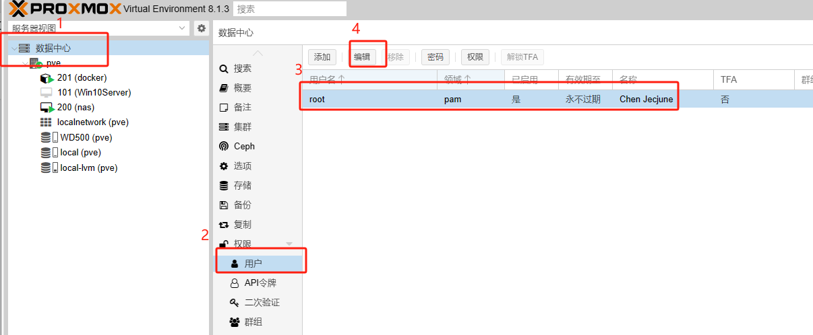
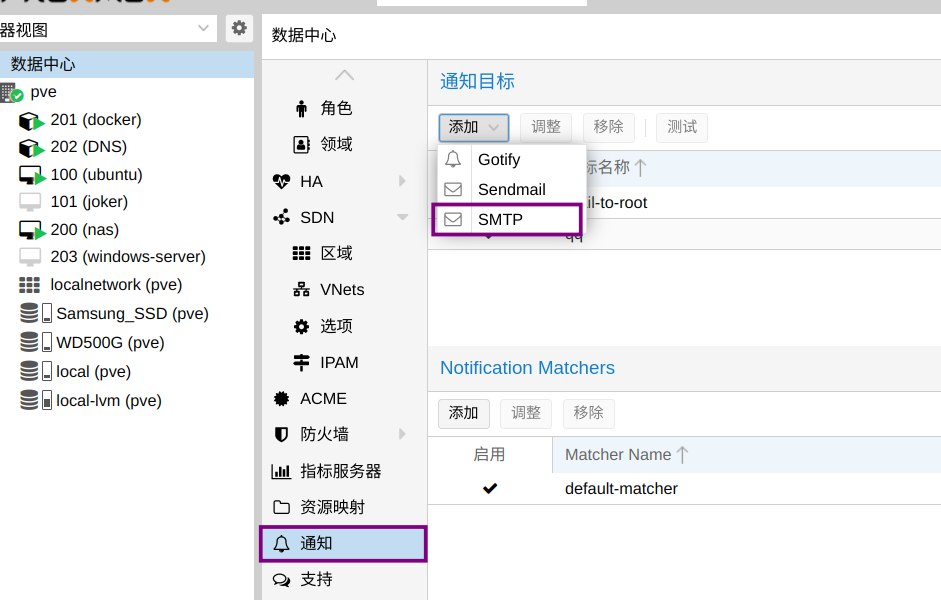
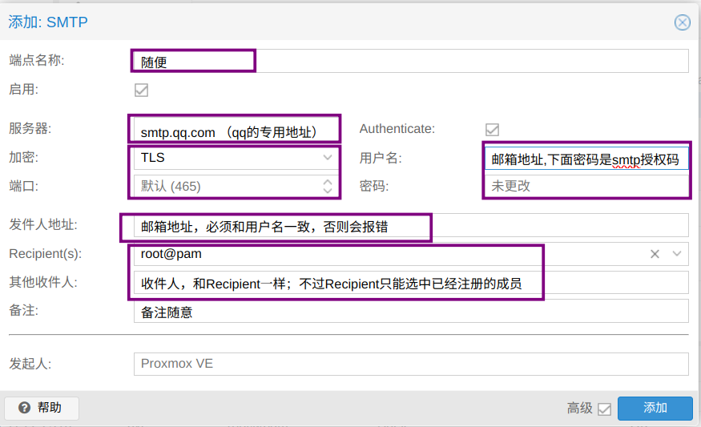
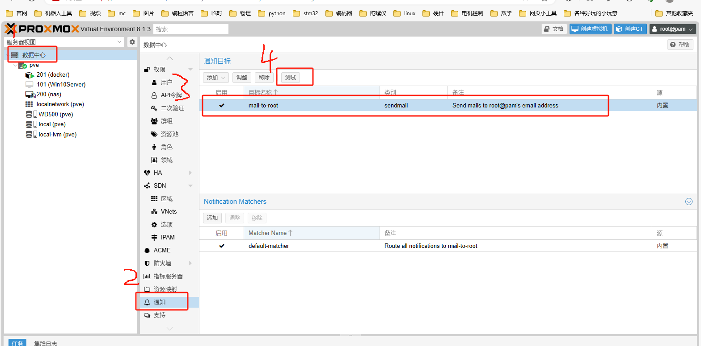
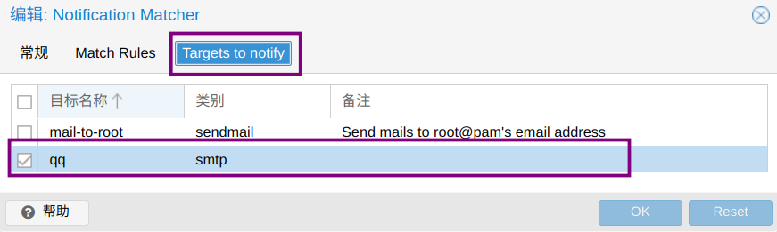

## QQ邮箱通知设置
1. 数据中心，选项，设置好“来自…邮件”。
这个是邮箱中显示发件人邮箱地址的设置。
2. 数据中心，权限，用户，设置好root账户的邮箱。


3. 安装libsasl2-modules。记得换源、apt update。
```php
apt install libsasl2-modules -y
```

 4. 重新加载postfix
```php
postfix reload
```

5. 新建SMTP账户： 
下面是qq邮箱的设置示例：



6. 测试邮箱是否正常:


7. 设定通知匹配器
将通知目标设置为刚刚新建的smtp账号
