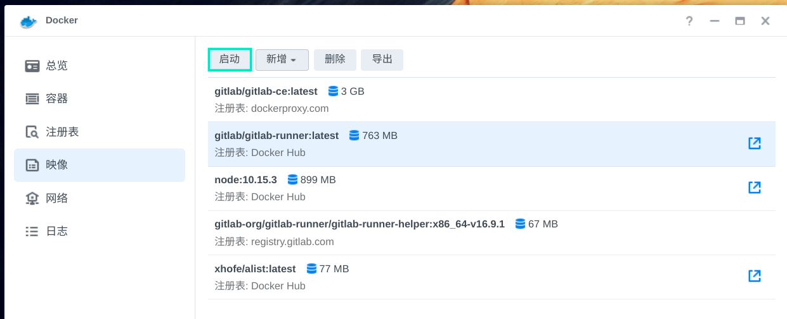
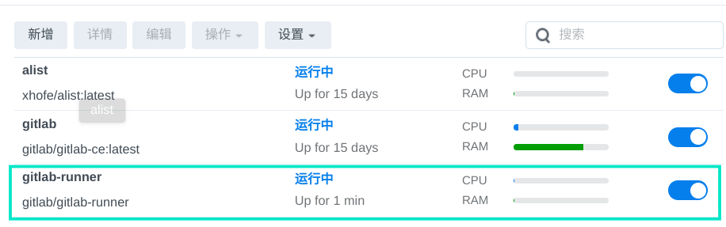
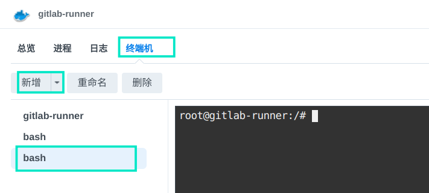
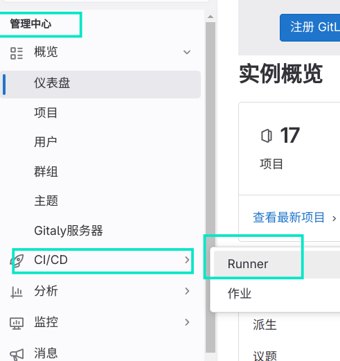
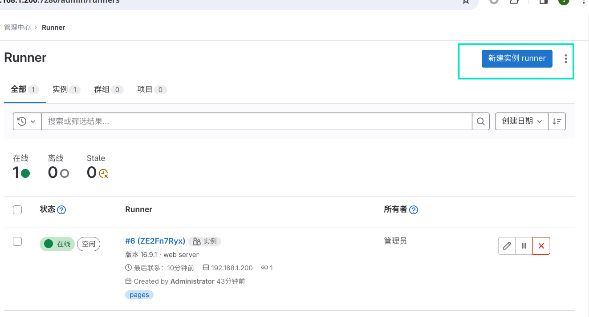
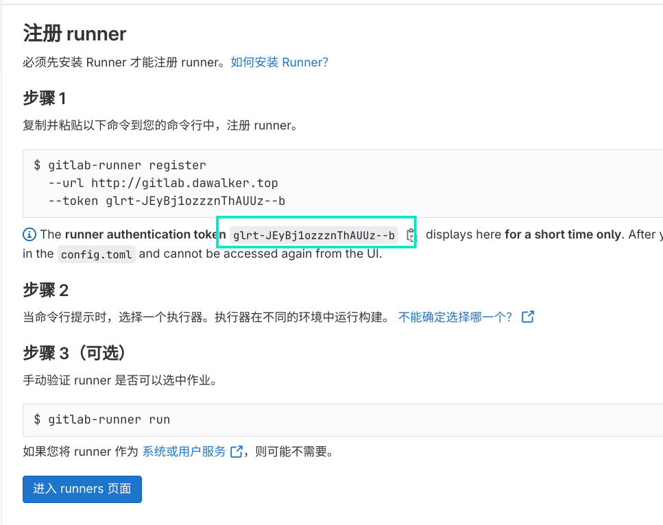
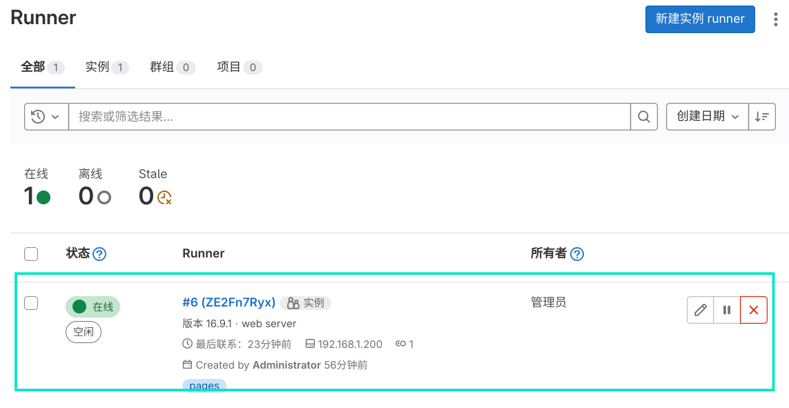
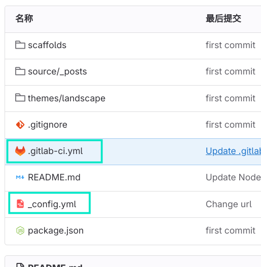

# gitlab-runner部署

gitlab-runner是为gitlab提供流水线服务，实现ci-cd的执行器，gitlab在收到相关作业的时候，就会通过调用gitlab-runner进行相关的工作，实现自动化。

## gitlab-runner的拉取
在群晖的网站上打开docker软件，在其中新增gitlab-runner的镜像，对于`gitlab/gitlab-ce:laster`版本的gitlab仓库，对应的`gitlab-runner`是`gitlab/gitlab-runner:laster`。如果无法从网站上拉取，可以通过链接群晖的ssh,使用命令行进行镜像拉取。

## 安装

找到刚刚拉取的镜像，点击启动，进行容器新建。
网路设置可以直接选择host，其他根据需求改，不知道怎么搞就直接默认设置都可以。
一切正常的话，runner就会在正常运行了。

如果出现runner意外停止，并提示gitlab-runner依靠gitlab运行，那么就是因为两者的版本不对应，即下错镜像了。

## 配置
此时runner容器还没有注册，是无法与gitlab联动并执行任务的。下面需要对runner进行部署。

进入gitlab-runner的详情页，在终端机一项中新建一个终端。

输入开始部署指令：
```php
gitlab-ci-multi-runner register
```

1.  `Please enter the gitlab-ci coordinator URL (e.g. https://gitlab.com/ci):`
该项它会要求输入gitlab的地址，我们当前因为gitlab和gitlab-runner都在局域网内，所以直接填写局域网中gitlab的ip地址即可（192.168.1.200：7280）。  
**关于非host网络设置的runner：**  
前面如果没有为gitlab-runner选择host网络设置的话，会无法通过局域网访问gitlab，此时可以通过使用公网网址来访问gitlab，走公网最好使用https。注意：如果没有使用host网络，貌似gitlab-runner无法与宿主机的docker守护程序取得链接，即无法创建新docker执行作业。（将runner注册为docker工作方式时（第四步会设置），runner不会自己进行作业，而是通知宿主机的docker创建新容器，然后runner将作业转接过去让新容器完成作业，最后再删除新容器）  
 **host网络设置的runner：**  
~~没试过多个gitlab-runner都使用host网络，可能会有端口冲突导致某个容器报废，出现问题的时候把其中一个容器关闭即可~~。实测如果runner注册为docker，没有出现问题。

2. `Please enter the gitlab-ci token for this runner:`
该项会要求填写gitlab-ci的令牌，这里需要在gitlab进行设置。打开gitlab管理中心，找到CI/CD中的runner管理界面。


新建实例：


这里主要有两个值得注意的地方，一个是标签。当存在多个runner实例的时候，gitlab会根据提交的作业中带有的标签来选择使用哪个runner进行作业。第二个是最大作业时间，当构建较大项目的时候，需要适当加大超时时间，因为一旦作业超时，作业就会被强制停止并报告错误。

确认创建之后，gitlab就会为runner提供一个容器位置，并提供相应的令牌来等待runner实例注册进来。这里复制它给出的令牌号并回到刚刚runner容器的后台粘贴上去。  
3. `Please enter the gitlab-ci description for this runner:`
为该runner容器添加描述，这个照自己喜好写就好。  
4. `Please enter the executor: docker-ssh, parallels, shell, ssh, virtualbox, docker+machine, docker-ssh+machine, docker:`
为runner选择工作方式，这里一般是通过docker进行工作，因为不用额外配置环境，以执行静态网页的nodejs为例，这里选择docker。随后它还会询问使用docker的什么镜像，这里选择 node:10 


最后它显示如下语句即为创建成功：`Runner registered successfully. Feel free to start it, but if it"s running already the config should be automatically reloaded!`
此时在gitlab的runner管理界面就可以看到注册成功的runner容器了。



## 如何使用gitlab-runner进行流水线操作？
你需要在你的项目中增加如下两个配置文件，当gitlab识别到项目中的配置文件之后，就会自动创建流水线作业，并唤起gitlab-runner进行相应的构建。
