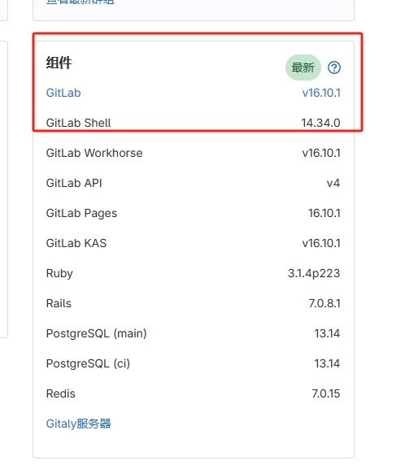
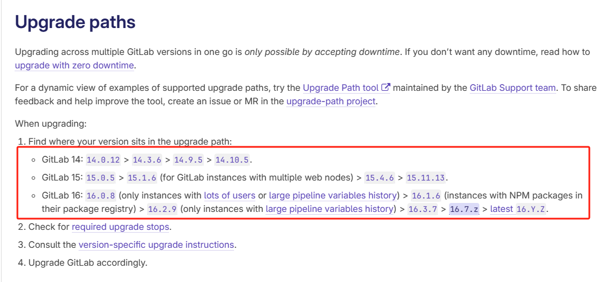
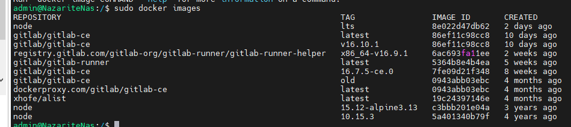
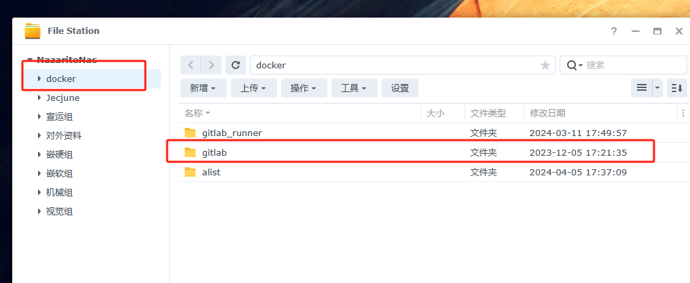
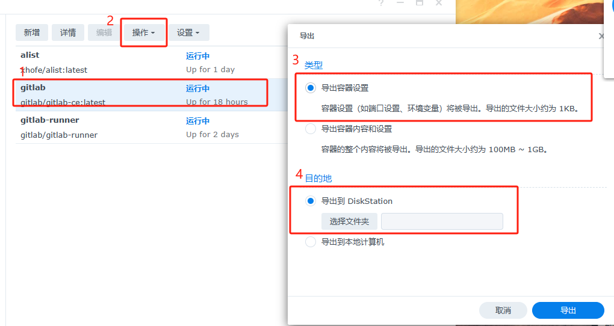
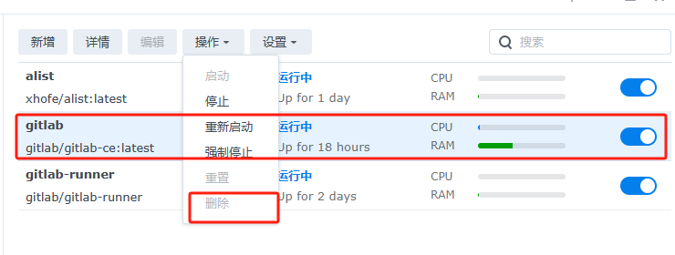
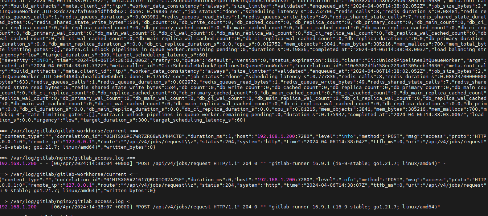

# gitlab升级

基于docker的升级比较简单，主要的注意点是：  
1. 要备份整个共享文件夹中的docker/gitlab文件夹（因为gitlab的所有数据映射到了该文件夹），防止升级失败数据丢失。  
2. 新的gitab容器要按照之前的gitlab容器设置配置  
3. **要按照官方给的版本升级路线一步步升级**，严禁跨版本升级。  


## 准备工作
1. 查询当前gitlab版本号，在管理中心-仪表盘的下方有当前所有gitlab主版本和插件的版本信息。 
  
2. 在[官网](https://docs.gitlab.com/ee/update/)查看当前最新版本是什么，并查看当前升级路线是什么。  

字母标号表示任意，大于号展示了每个版本之间的接替关系。如`16.2.9 > 16.3.7 > 16.7.z`表示在`16.2.9`和 `16.3.7`之间的版本都要升级为`16.3.7`，然后才能升级到`16.7.z`


3. 提前拉取相关镜像

镜像的版本号在[docker hub](https://hub.docker.com/r/gitlab/gitlab-ce/tags)可以查看，先找到需要的版本。

使用ssh连接到群晖。
```bash
ssh admin@192.168.1.200
```
如果是windows请使用相关软件进行连接。

拉取所有需要的版本的镜像，类似如下指令：
```bash
sudo docker pull gitlab/gitlab-ce:16.7.5-ce.0
```
然后确认是否版本齐全了：
```bash
sudo docker images
```


## 开始升级
1. 在群晖docker管理停止容器运行。
2. 对gitlab数据进行全盘备份。位置在docker/gitlab，直接将整个gitlab文件夹复制一份到其他位置。

3. 导出gitlab容器设置。


上述两步是为了将数据完全备份，当升级失败导致gitlab无法启动的时候，请将第二步复制出来的文件重新覆盖回去，然后使用导出的gitlab容器配置创建gitlab容器即可还原。
3. 选中gitlab并移除

4. 按照[旧容器的配置](gitlab的安装.md#oldgitlab)新建容器，不过选用的image是新版本的image（一定注意不要跨版本升级）。主要的两步是网络端口的映射和文件路径的映射。  
5. 等待容器启动并自动执行升级，大概四到五分钟。然后在ssh连接的终端中查看gitlab容器的日志
```bash
sudo docker logs gitlab
```
如果日志中没有大段连续的输出，即配置基本完成，此时可以登录gitlab网址，查看服务是否正常，数据是否有丢失。最后到仪表盘中查看版本信息是否正确。  
  
6. 至此，升级已经结束，如果还需要进一步更新版本，重复“开始升级”步骤即可。

## 清理工作

1. 安装结束后，gitlab备份文件建议保留至少半个月，确保没有问题后再删除数据备份。

2. docker images 保留最新的一份，其余残留版本可以清除。

建议对images进行重命名，方便后续识别版本。
```php
docker tag gitlab/gitlab-ce:latest gitlab/gitlabce:16.10.1
```
```
docker tag 旧映像 新映像
```