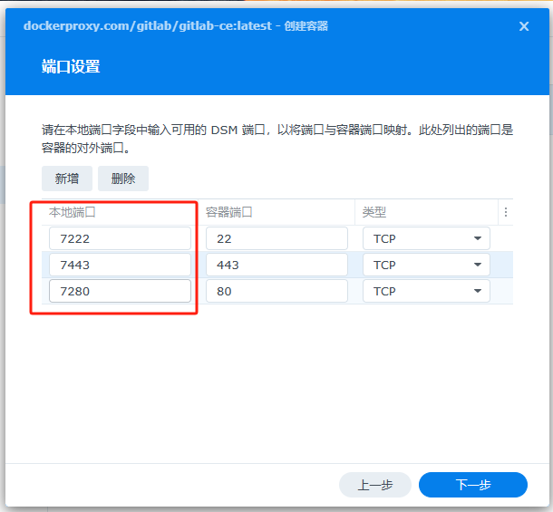
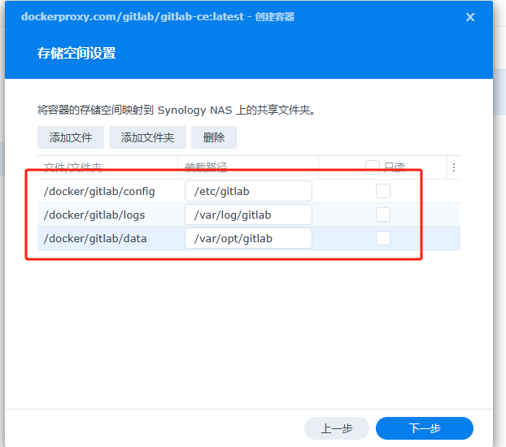
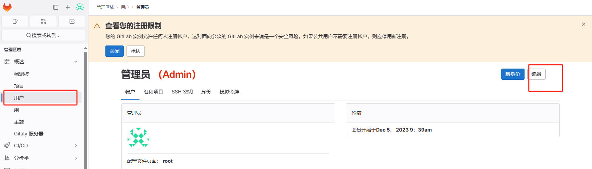

# gitlab的安装

## 安装docker并下载镜像

在群晖套件中心下载docker，记得将安装位置设置在固态硬盘中


打开群晖的ssh连接
启用admin用户并设置密码
使用ssh连接到群晖的 ip:22 端口

找到需要的镜像名字(当前使用的是gitlab/gitlab-ce),使用加速网站: https://dockerproxy.com/

## 在群晖文件管理中新建文件夹
需要三个文件夹:
<a name="oldgitlab"></a>
docker-config  
docker-data   
docker-logs

新建之后更改文件夹属性，在权限页面选择everyone，加入可读可写权限，并勾选应用所有
**记得回到账户管理把对外的账户权限设为不可访问**


这些文件夹后续将映射到容器内部使用，用于保存容器内部的数据

## 新建gitlab容器

进入docker映像页，双击新建容器


保存并点击下一步，这里需要完成端口映射：


然后需要把刚刚新建的文件夹映射到容器内部

```
/etc/gitlab
```
```
/var/log/gitlab
```
这个是仓库存储位置
```
/var/opt/gitlab
```


随后等待安装即可，大概五分钟左右，到内存占用3~4G就差不多了

## gitlab配置

访问刚刚设置的80端口，ip为群晖的ip，即可打开gitlab。


第一次需要通过链接群晖的命令行获取默认root密码
```php
 sudo docker exec -it gitlab grep 'Password:' /etc/gitlab/initial_root_password
```
进去先修改密码：


修改语言为中文：
![[gitlab安装9.png]]


## gitlab反向代理配置

#### 配置反向代理的原因:
公司有一个公网 IP 被分配或者映射到了某台内网的 CentOS 虚拟机上面，在这台机器上面安装 Nginx，实现了内网服务的域名解析等功能，提供外部访问能力。这可能是大多小公司的目前办公室内部的网络结构。（也是当前配置的方案）
而 GitLab 直接安装的运行建议则是理想中的状态，也就是那台机器本身具有公网 IP 地址，域名可以直接解析到上面。
直接 nginx 反向代理用户是可以直接使用的，但是 ssh 克隆和 HTTP 克隆在页面上显示的地址可能会是内网 IP 地址，这样会导致：当使用域名登录页面，在线浏览某个文件的时候，可能会跳转到内网 IP 地址的页面去，导致登录失效，甚至无法打开。

#### 网络架构:
流量流向：外部访问申请--服务器nigix反向代理重定向服服务器端口--frp代理映射到内网服务端口---进入内网gitlab端口

#### 具体端口：
服务器443-服务器2500-群晖7280-gitlab80

#### 步骤:

1. 查看配置文件 gitlab.yml：
```php
vi /opt/gitlab/embedded/service/gitlab-rails/config/gitlab.yml
```
```
# 可以看到内容是不正确的,该文件是由gitlab-ctl管理的,所以要去另一个文件修改
gitlab:
  host: gitlab
  port: 80
  https: false

  ssh_host:
```

2. 修改配置文件 gitlab.rb：
```php
vi /etc/gitlab/gitlab.rb
```
修改gitlab内部域名：
```
# 配置域名地址,开局0%位置
external_url 'http://gitlab.dawalker.top'
```

如果需要使用ssh,ssh的端口也需要更改,否则拉取地址就指向代理服务器的22端口了,而该22端口最好不要拿去映射.
```
# 配置 ssh 地址,开头1%的位置
gitlab_rails['gitlab_ssh_host'] = 'gitlab.dawalker.top'

# SSH 端口,20%的位置
gitlab_rails['gitlab_shell_ssh_port'] = 10022
```

3. 重启服务：
```php
gitlab-ctl reconfigure && gitlab-ctl restart
```


***
## ubuntu下安装gitlab
准备工作：
检查当前内存情况是否符合最低要求。
```bash
free -l
```
如果不够需要进行swap的拓展,下面是一个例子，请根据自身情况具体调整：
增加分区大小：
```bash
dd if=/dev/zero of=/data/swap bs=1024 count=2048000
```
设置为交换空间
```bash
mkswap /data/swap
```
启用该交换空间
```bash
swapon /data/swap
```
对应的关闭指令：
```bash
swapoff /data/swapp
```
如果需要开机引导时自动加载，需要编辑`vim /etc/fstab`，添加如下代码:
```
/data/swap swap swap defaults 0 0
```


1. 安装依赖 
```bash
sudo apt-get install curl openssh-server ca-certificates postfix
```
2. 添加gitlab包源并安装
```bash
curl -sS http://packages.gitlab.com.cn/install/gitlab-ce/script.deb.sh | sudo bash
```
```bash
sudo apt-get install gitlab-ce
```
3. 配置并重启gitlab
```bash
sudo gitlab-ctl reconfigure
```
4. 检查是否安装成功
```
sudo gitlab-ctl status
```

5. 检查配置文件并进行对应修改
```bash
sudo vim /etc/gitlab/gitlab.rb
```

### gitlab runner的安装
1. 添加仓库源
```bash
curl -L "https://packages.gitlab.com/install/repositories/runner/gitlab-runner/script.deb.sh" | sudo bash
```
安装
```bash
sudo apt install gitlab-runner
```

