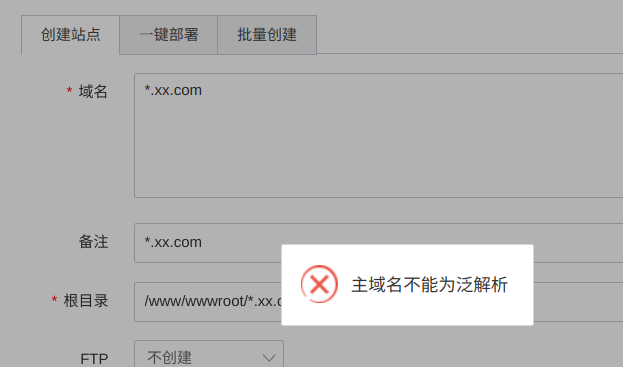
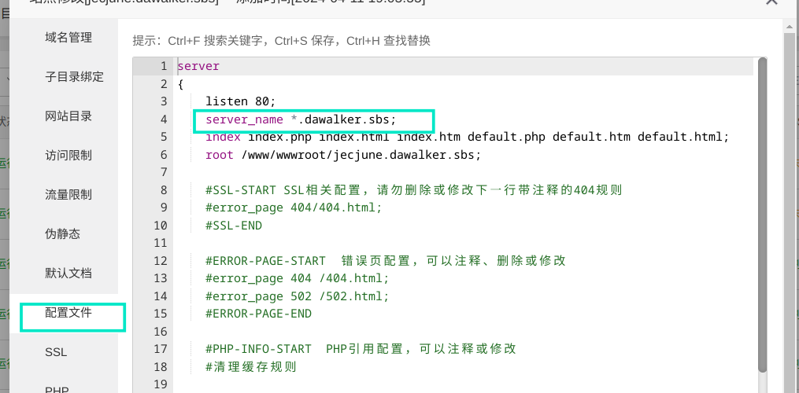
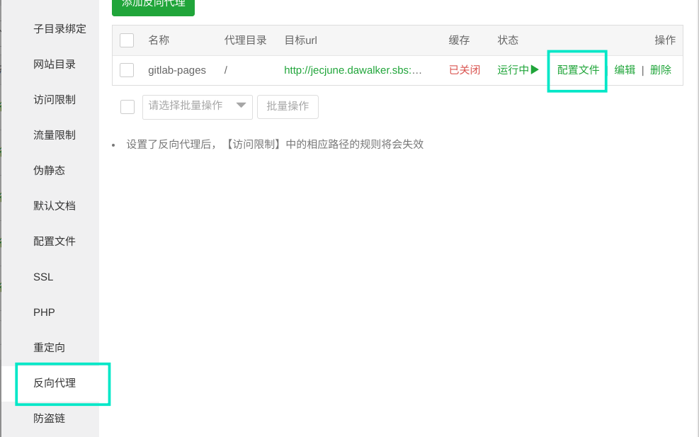
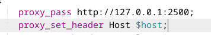

# 局域网反向代理
## 方法一：使用宝塔面板

请看：[基于宝塔面板的反向代理](../../ESC系列/网络配置/基于宝塔面板的反向代理.md)

配置完成后可以通过curl指令测试是否代理成功，如果能返回对应网址的 html 文件的输出及配置成功了。


## 宝塔部分问题的逃课方法（进阶操作）
<a name="da77de"></a>
####  1. 无法添加泛域名站点
如果你的面板安装的是nginx，那么本身是支持泛域名解析的，但是在添加泛域名的时候，会提示如下信息：  


解决方法简单，随便写个域名，先让它创建完站点信息。  
然后点击网点的设置，选中配置文件，直接改server_name为想要的泛域名：  


#### 2.使反向代理支持泛域名代理

<a name="da88de"></a>

同样的，先在网页配置中随便添加一个反向代理创建一个代理文件。然后点配置文件，直接改配置。



***注意：gitlab pages的流量请务必注意使用原始请求进行转发，否则会因为域名的不一致导致无法找到对应的gitlab pages，具体操作如下：***

先将`proxy_pass`指向本机的同一个端口，然后将`proxy_set_header Host`设置为 `$host`，确保将原请求后传。




## 方法二：手动编写nginx


先安装nginx
```bash
sudo apt install nginx
```

修改配置文件:
```php
nano /etc/nginx/nginx.conf
```

在http服务段中加入以下反代理的配置：
```
server {
        listen       80;
        server_name  gitlab.dawalkers.top;

        location / {
            proxy_pass   http://192.168.1.200:7280;
        }
    }

server {
        listen       80;
        server_name  nas.dawalkers.top;

        location / {
            proxy_pass   http://192.168.1.200:5200;
        }
    }
server {
        listen       80;
        server_name  www.dawalkers.top;

        location / {
            proxy_pass   http://192.168.1.200:5244;
        }
    } 
```

检查语法错误：
```php
sudo nginx -t
```

重启nginx服务
```php
service nginx restart
```

查询反向代理是否实现，在反向代理服务器上运行：
```
curl http://www.dawalker.top
```