# 群晖的安装
## 第一步，引导文件的下载
首先需要pve的运行环境，这里使用大佬提供的引导工具：[Releases · fbelavenuto/arpl (github.com)](https://github.com/fbelavenuto/arpl/releases)。这里需要下载这个。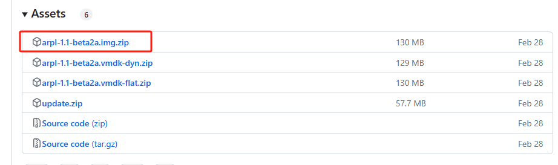
解压后在local存储库中上传镜像搭到pve中。

## 第二步，创建虚拟机

常规设置随便写即可，开机自启动建议在配置完成后再开启。

选择不使用任何介质。
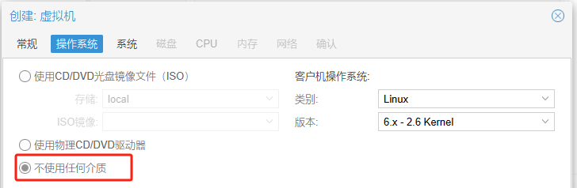

在系统设置页面,一般情况下全部保持默认值即可，如果该虚拟机需要直通显卡,可以把BIOS改成OVMF(UEFI),存储选择local,机器改成Q35.，这里保持默认。
磁盘页也随便选选就好了，反正后面要删掉重开。

CPU页核心数照实际需求写，一般4个够了。
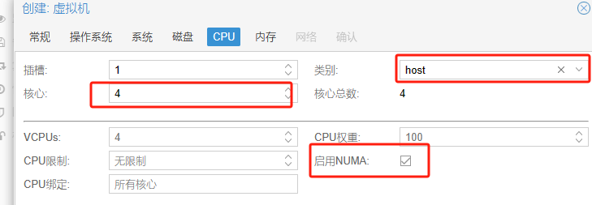

内存按实际硬件和需求写。
网络默认即可，最后点击确认。

关于虚拟机的配置文件在：
```php
nano /etc/pve/qemu-server/<虚拟机编号>.conf
```

然后转到新建的虚拟机硬件中，分离刚刚绑定的硬盘并移除。（忘截图了，借用个知乎的图）
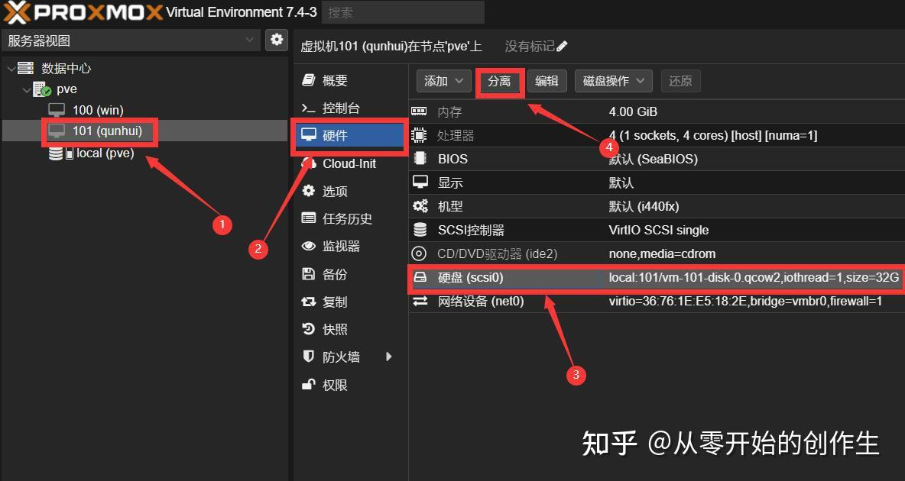
将没用的CD驱动器也移除。
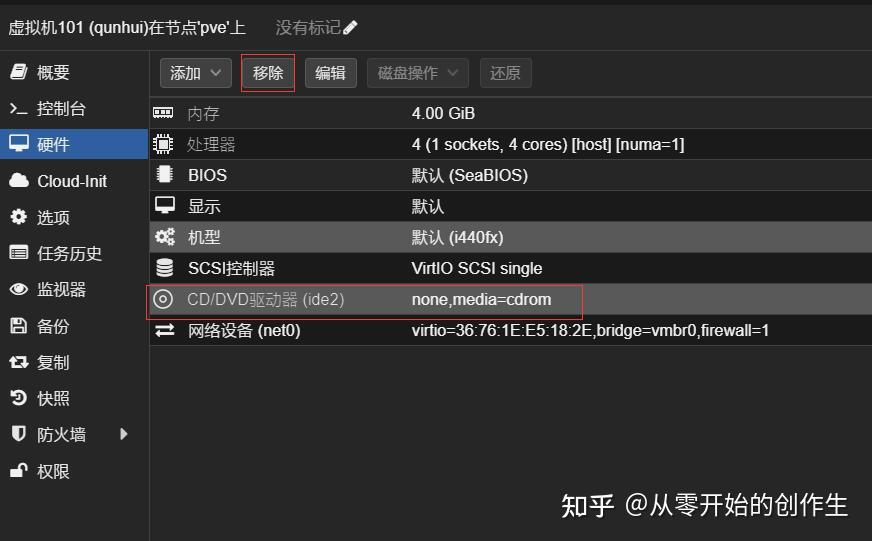

转到pve后台，将引导文件作为硬盘添加到虚拟机中。输入
```php
qm importdisk 101 /var/lib/vz/template/iso/arpl.img local-lvm
```
这行代码每个人都略有区别，101是虚拟机编号，也就是创建虚拟机时的VM ID；那个路径是刚刚上传的镜像的地址；local-lvm是指定文件的存储磁盘，一般没删除过local-lvm的就写local-lvm就好了；出现一行“successful”的提醒就成功了。

来到虚拟机的“硬件”栏目下，可以看到一块未使用的硬盘，这就是刚刚指令添加的，双击它，将“总线/设备”改为SATA。再来到虚拟机的“选项”栏目下，双击“引导顺序”，勾选“SATA0”，取消“net0”勾选，调整引导顺序将刚刚的SATA放首位。

*直通*：**直通的意义是将硬盘的控制权直接交给虚拟机，使虚拟机不用经过pve的虚拟层，从而得到更高的硬盘性能。值得注意的是，直通后的硬盘将只有那个虚拟机能够对硬盘进行读写操作，如果你的硬盘已经在使用了，请切勿进行直通，否则将可能出现不可逆转的数据丢失。**

回到pve后台，将机械硬盘直通到群晖中。输入
```php
ls /dev/disk/by-id/
```
这里要找的不是分区表，而是要找到物理硬盘的id，如下图所示。
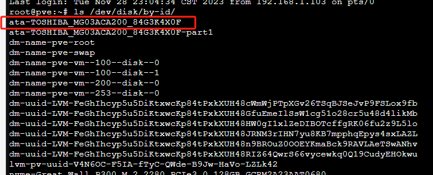

然后输入
```php
qm set 101 -sata1 /dev/disk/by-id/ata-TOSHIBA_MG03ACA200_84G3K4X0F
```
**ata-TOSHIBA_MG03ACA200_84G3K4X0F**就是上面看到的硬盘id。**-sata1**是设定该硬盘的编号，按上述流程的话，这里是第二块硬盘，所以设为sata1。添加完成后在虚拟机的硬件页就能看到新添加的硬盘了。

必须明确的一点是，当前设置下，只加载了两个硬盘，一个是从固态硬盘中虚拟出来的引导盘SATA0，一个是作为存储盘（直通进来的那个）的机械硬盘SATA1，由于系统和套件的运行，所以机械硬盘基本不可能休眠。这里提供一种思路，即另外从固态硬盘中虚拟多一个硬盘，并创建出多一个存储池，docker以及套件就安装到这上面

## 第三步，正式开始群晖部署

启动虚拟机，来到控制台页面，在控制台输出中找到IP地址，然后使用浏览器访问ARPL的配置页面。
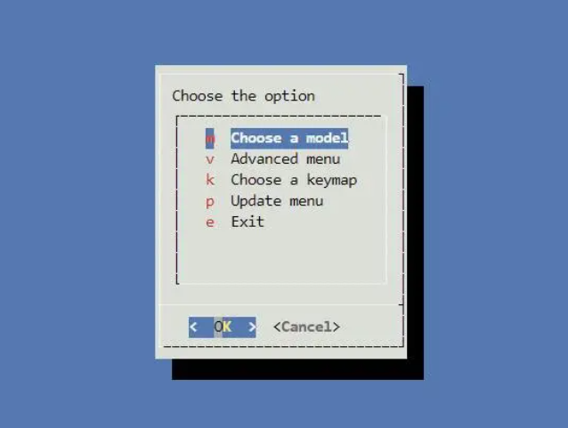

选择“Choose a model”，选择自己喜欢的型号，如果你想恢复硬盘里的老系统，记得选择一样的型号。我选择了经典的918+。
选择“Choose a Build Number”，这里选择我们的群辉DSM系统版本，对于918+的42962版本，就是DSM 7.1.1。同样的，要恢复老硬盘中的系统，记得选一样的。

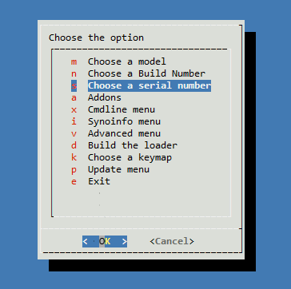

选择“Choose a serial number”，你可以选择键入sn码如果你有的话，也可以像我一样选择“Generate a random serial number”生成一个。

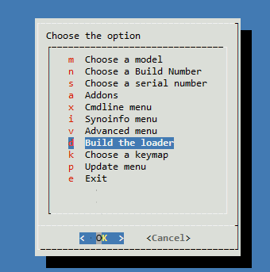

选择“Build the loader”点击“ok”来编译引导，等待完成后会自动弹出下个界面，选择“Boot the loader”点击“ok”启动引导。
到这里就可以看到群辉的ip地址了，等待一会儿在浏览器输入IP:5000就可以进到群辉的配置界面。

如果你用的老硬盘这里就可以直接进到老硬盘里的系统了，所有的设置都在。
新硬盘继续安装。这里会要求上传.pat文件，这里去下载中心下载对应的DSM版本就可以了。
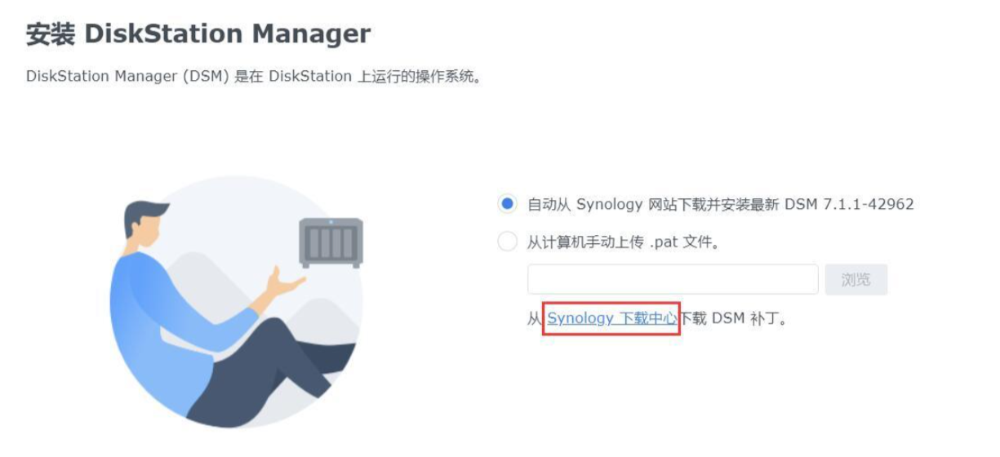

下载完成后完成手动上传并确认。
随后会要求确认删除所有数据，确认即可。
随后等待完成重启连接就行了。
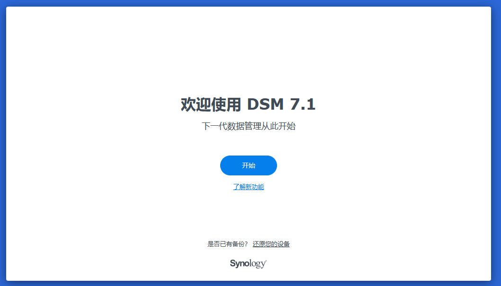
## 第四步，存储池建立

建议使用***ext4+Raid1**方式。其他相关知识请参考[什么是磁盘阵列？15种RAID优缺点详解 (RAID5 RAID6 RAID10 RAIDZ SHR UNRAID)_哔哩哔哩_bilibili](https://www.bilibili.com/video/BV1vA411W7yU/?spm_id_from=333.1007.top_right_bar_window_history.content.click&vd_source=ddab1a0dd4541fa1595af520c871207e)，以及自行搜索相关知识。

部分知识点：

**SHR**：可以很方便地添加冗余硬盘，会根据硬盘数量灵活采取存储方式，但是由于SHR是特殊的形式，因此必须连接群晖主机才能完成数据读取，在明确自己需要什么阵列的时候，直接选RAID就好了，否则就选这个。<br>
**RAID0**：将数据分布在两块硬盘中，一个硬盘坏了就全阵列数据损坏，数据读写性能会更好。<br>
**RAID1**：数据分为两份一样的存储在两块硬盘中，任一一个坏了都能恢复，读取性能提升，写性能等同于单块硬盘。<br>
**RAID5**：三块硬盘组成阵列，每块硬盘分1/3作为校验数据存储，在损坏一块硬盘的情况下能够执行完全数据恢复（看评论貌似恢复成功率挺低的），读写速度比RAID0稍弱。<br>
**RAID6**：四块硬盘组成阵列，每块硬盘都分一部分放校验数据，支持在损坏两块硬盘的情况下恢复数据。<br>
**RAID10**：先RAID1，再RAID0。即先两两复制，再组成RAID0。<br>
**RAIDZ**：基于ZFS文件系统的软RAID，支持一些先进功能，例如创建跨硬盘的存储空间，旧数据被覆盖后仍可找回等。


文件系统：<br>
ext4：稳定的老大哥，基本所有linux系统都能读取，且没有什么bug，性能也有保证，建议这个。<br>
btrfs：较新的东西，有一些特殊功能，但是数据恢复会困难一些。


## 其他群晖操作

### 添加邮箱通知
控制面板-通知设置-电子邮箱：

发件人中的邮箱就是邮箱号，但是密码不是一般的邮箱登录密码，而是邮箱的授权验证码。（所有mail组件都是这种形式）QQ邮箱的话，登录邮箱后在设置，账户，账户安全中可以找到
”POP3/IMAP/SMTP/Exchange/CardDAV/CalDAV服务“ ，开启后就可以得到一个授权码，填写进去即可。

### frp端口映射时的注意事项

如果开启了https的重定向
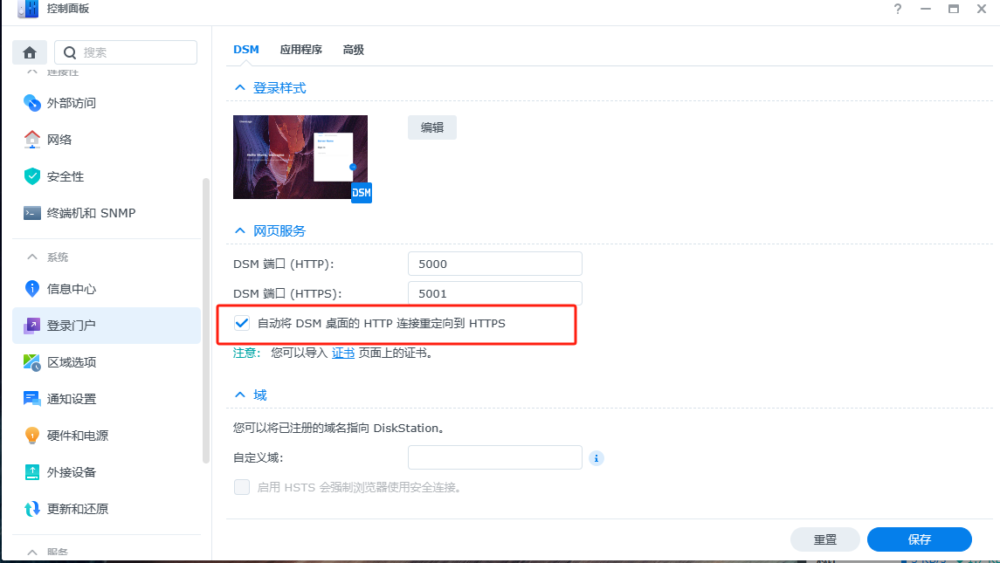

那么在进行frp映射的时候，不能映射http端口，因为会被重定向到5001端口，而frp的代理服务器的5000端口没有进行映射，即重定向后无法指向正确的群晖端口。所以直接将5001端口进行映射，后续通过https进行链接即可。

### SSH

通过ssh链接到群晖，可以使用命令行对群晖进行系统级操作。

1、在群晖的控制面板中搜索ssh，打开ssh服务，端口默认22就可以了。<br>
2、远端的电脑安装一个支持ssh连接的端口服务软件，这里采用putty，其他的Moba_Xterm也挺好用的    （下载网址：[putty下载](https://www.chiark.greenend.org.uk/~sgtatham/putty/latest.html)）注意，这里安装完成后不会在桌面创建快捷方式，需要到开始菜单找一下。<br>
3、配置 putty 的ssh链接服务。<br>
这里需要找到nas的ip地址，在pve控制面板中可以看到设置的ip地址。输入到putty中即可，如：`192.168.1.103`。然后点接受即可进到nas的远程命令行，进入命令行后输入账号密码登录，默认不是root权限，输入`sudo -i`提权。（如果报错没有sudo指令，那么退出使用root账号登录，密码用管理员的密码即可，登录后直接就是root权限）


另：putty使用技巧<br>
1，鼠标直接选取就会自动复制内容<br>
2，鼠标右键就是粘贴内容

### 通过docker拓展群晖功能

**常用docker源：**

Dockerhub仓库1：`https://hub.docker.com/`

Dockerhub仓库2：`https://registry.hub.docker.com`

镜像代理加速网站：`https://dockerproxy.com/`

镜像加速器地址：`https://gist.github.com/y0ngb1n/7e8f16af3242c7815e7ca2f0833d3ea6`
		`https://registry.hub.docker.com/`

**常用软件：**

**[Gitea的安装（附带sql）](群晖Gitea安装.md)**

**[Alist的安装](alist的安装.md)**

[Gitlab的安装](../gitlab/gitlab的安装.md)